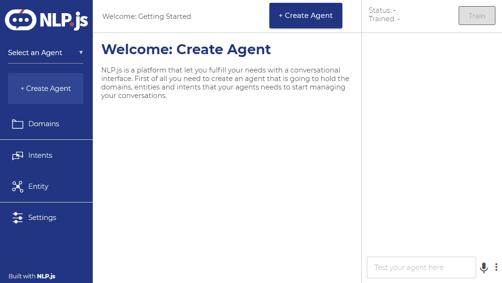
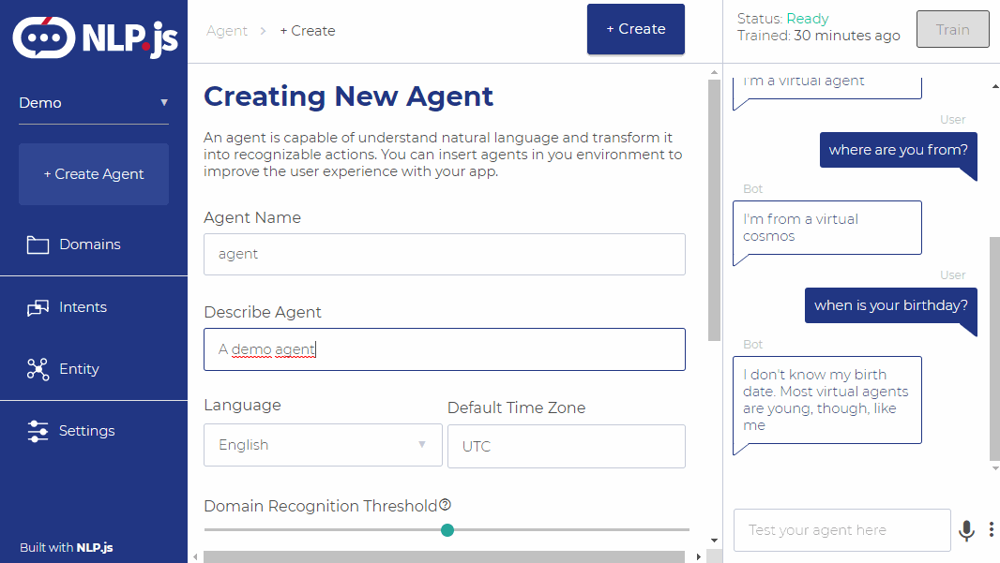
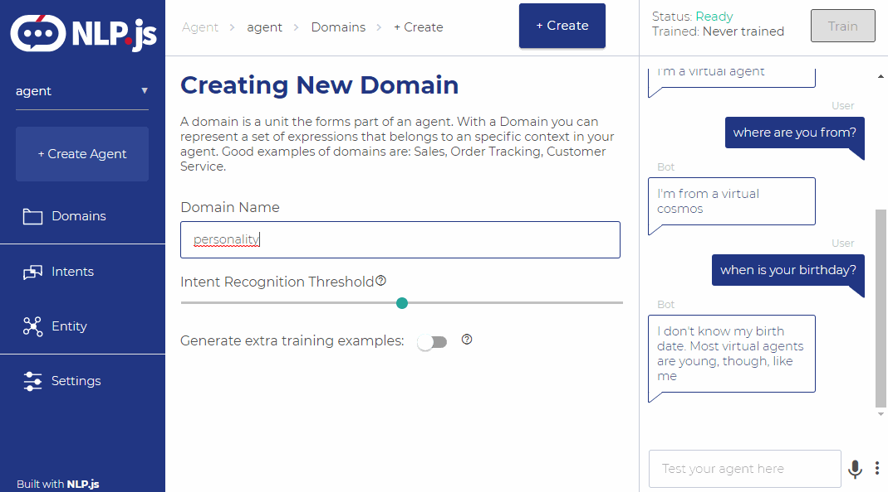
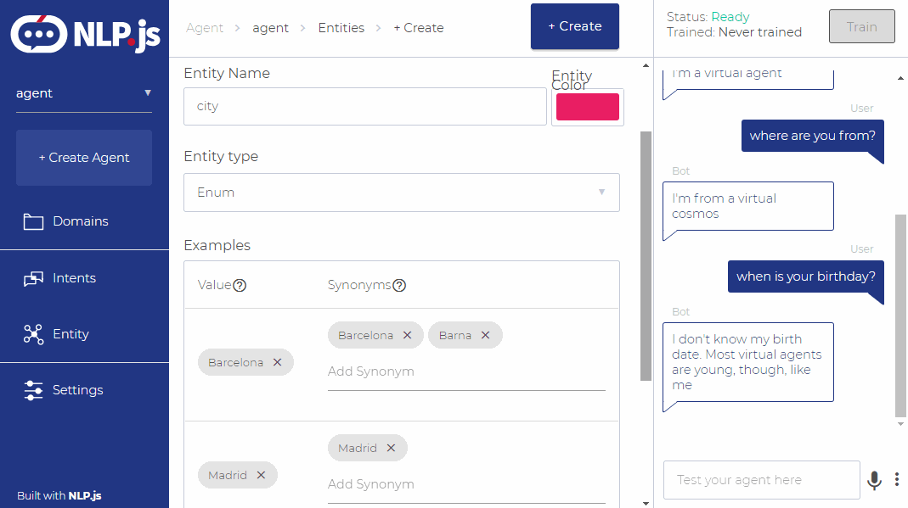
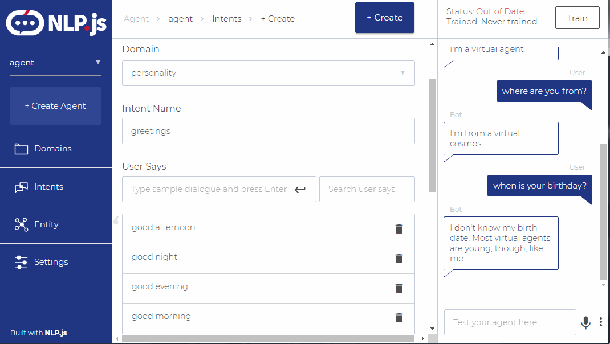
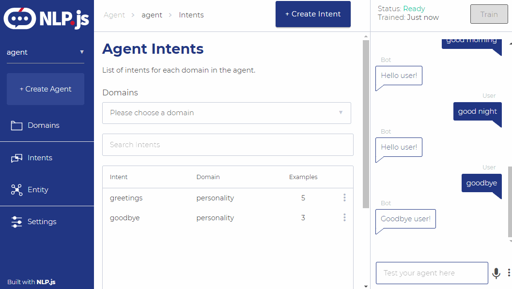
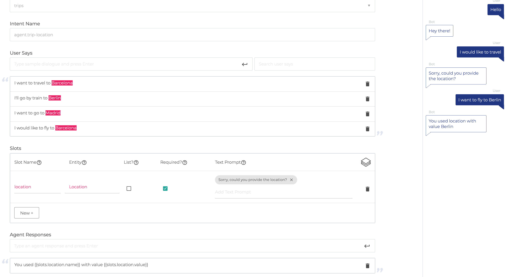
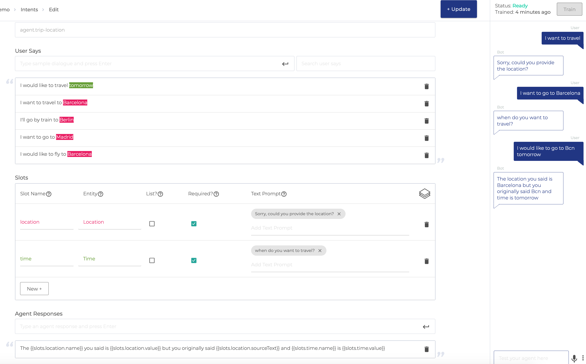

<div align="center">

</div>

# NLP.js App
Application to train your agents for bots, done using NLP.js.

Based on https://github.com/axa-group/nlp.js-app

34 languages supported: Arabic (ar), Armenian (hy), Bengali (bn), Basque (eu), Catala (ca), Chinese (zh), Czech (cs), Danish (da), Dutch (nl), English (en), Farsi (fa), Finnish (fi), French (fr), Galician (gl), German (de), Greek (el), Hindi (hi), Hungarian (hu), Indonesian (id), Irish (ga), Italian (it), Japanese (ja), Norwegian (no), Portuguese (pt), Romanian (ro), Russian (ru), Slovene (sl), Spanish (es), Swedish (sv), Tagalog (tl), Tamil (ta), Thai (th), Turkish (tr), Ukrainian (uk)

<div align="center">

</div>

### TABLE OF CONTENTS

<!--ts-->

- [Installation](#installation)
- [Example of Use](#example-of-use)
- [Software Used](#software-used)
- [Contributing](#contributing)
- [Code of Conduct](#code-of-conduct)
- [Who is behind it](#who-is-behind-it)
- [License](#license.md)
  <!--te-->

## Installation
To deploy in AWS, follow these steps (tested on MacOS 10.15.5). You may also use a Linux machine to follow these steps:
### 1. Adjust the Cloudformation template  
Open aws-nlpjs-solution.tempate and look for the Mappings block as below. Adjust the S3Bucket and Prefix values to the bucket that you will create in Step 2. 
```yaml
Mappings:
    SourceCode:
        General:
            S3Bucket: "dixonaws-solutions"
            KeyPrefix: "nlpjs/v1.0"
```

### 2. Copy the source source files in S3
####a. Create an S3 bucket 
Create a bucket and a directory within it to store the source code for this solution.

####b. Build the source files
run build.sh to generate the source files (lambda_function.zip and nlpjs-trainingapp.zip) /dist. You can then 

####c. Copy the source files to your S3 bucket 
Copy the following files to the nlpjs/v1.0 directory:
- lambda_function.zip: Lambda deployment package for the custom resource helper
- nlpjs-trainingapp.zip: source code for the training application

Note: You can use the publish.sh script to copy the source files to the appropriate bucket. Adjust the $NLPSRCBUCKET variable in the publish.sh script before running.

### 3. Deploy the cloudformation template
Per usual in AWS. Alternatively, you can use the launch_solution.sh script to launch the stack for you. Adjust the parameters for AWS_REGION and ADMIN_EMAIL before running the script. The script will name the stack nlpjs-$1, where $1 is the first argument to the script. launch-secure-solution.sh will launch a Cloudformation template that includes authorization for the Training Application. 

The stack will deploy in 5-10 minutes. The Cognito service will send an email to ADMI_EMAIL in order to sign in to the Training Application. Tested in us-east-1.

#### 4. Access the Training Application
Check the output of the Cloudformation stack to find the signin URL and the URL for the Training Application.

#### 5. (optional) Deleting the stack
Among other things, the stack will create an S3 bucket and a Cloudfront distribution. By default, S3 buckets are not deleted with the stack. You must manually empty and delete the S3 bucket in order to successfully delete the Cloudformatio stack.  

## Example of use
You can create an agent:

<div align="center">

</div>

Then create at least one domain:

<div align="center">

</div>

Create some entities if you need them:

<div align="center">

</div>

Create some intents:

<div align="center">

</div>

Train and test:

<div align="center">

</div>

### Slot filling

It's also possible to check required entities within an intent.

Example of basic slot filling:

<div align="center">

</div>

Example of multiple slot filling used in the same intent:

<div align="center">

</div>

## Software Used

This project is based on the Articulate Project from Samtec, that you can find here: https://github.com/samtecspg/articulate

## Contributing

You can read the guide of how to contribute at [Contributing](https://github.com/axa-group/nlp.js-app/blob/master/CONTRIBUTING.md).

## Code of Conduct

You can read the Code of Conduct at [Code of Conduct](https://github.com/axa-group/nlp.js-app/blob/master/CODE_OF_CONDUCT.md).

## Who is behind it?

This project is developed by AXA Group Operations Spain S.A.

If you need to contact us, you can do it at the email jesus.seijas@axa.com

## License

Copyright (c) AXA Group Operations Spain S.A.

Permission is hereby granted, free of charge, to any person obtaining
a copy of this software and associated documentation files (the
"Software"), to deal in the Software without restriction, including
without limitation the rights to use, copy, modify, merge, publish,
distribute, sublicense, and/or sell copies of the Software, and to
permit persons to whom the Software is furnished to do so, subject to
the following conditions:

The above copyright notice and this permission notice shall be
included in all copies or substantial portions of the Software.

THE SOFTWARE IS PROVIDED "AS IS", WITHOUT WARRANTY OF ANY KIND,
EXPRESS OR IMPLIED, INCLUDING BUT NOT LIMITED TO THE WARRANTIES OF
MERCHANTABILITY, FITNESS FOR A PARTICULAR PURPOSE AND
NONINFRINGEMENT. IN NO EVENT SHALL THE AUTHORS OR COPYRIGHT HOLDERS BE
LIABLE FOR ANY CLAIM, DAMAGES OR OTHER LIABILITY, WHETHER IN AN ACTION
OF CONTRACT, TORT OR OTHERWISE, ARISING FROM, OUT OF OR IN CONNECTION
WITH THE SOFTWARE OR THE USE OR OTHER DEALINGS IN THE SOFTWARE.
